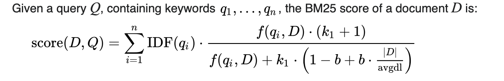
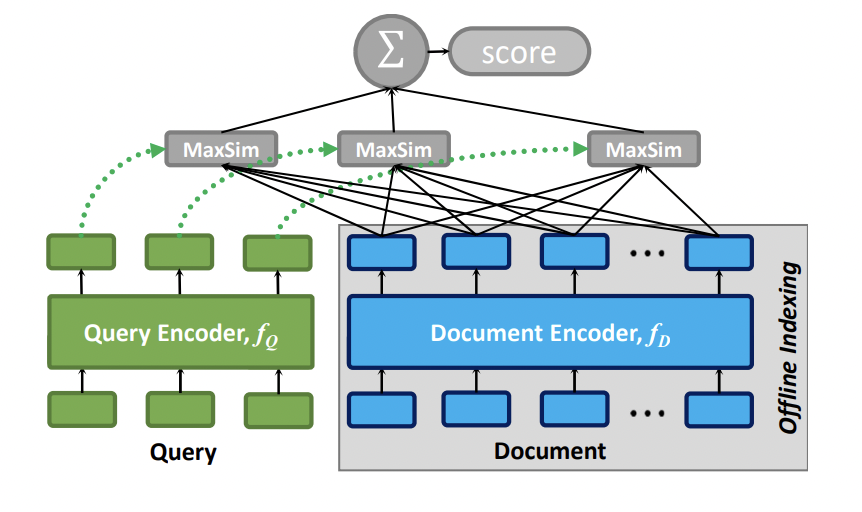
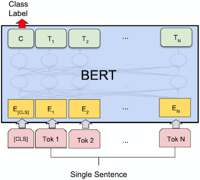
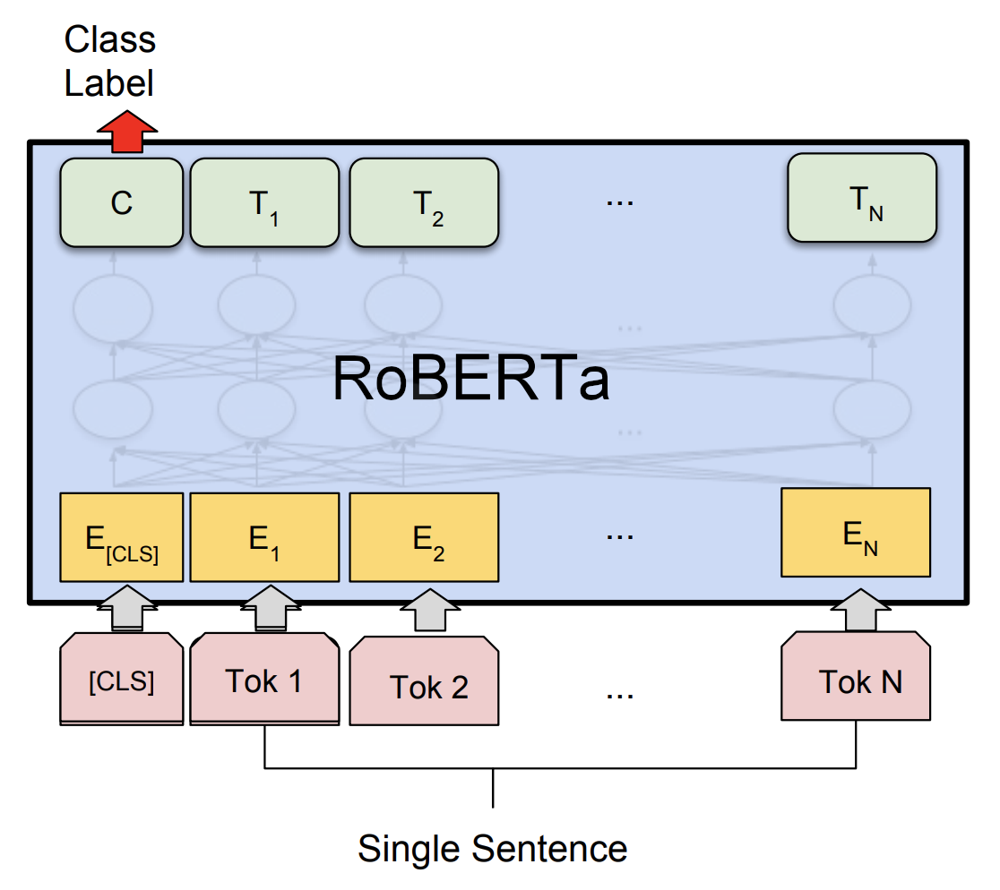
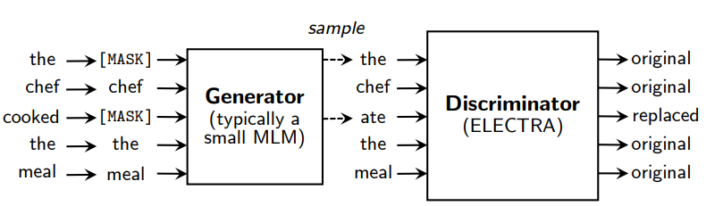
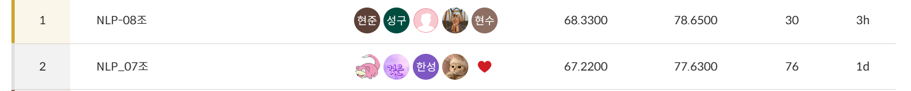

# ODQA(Open Domain Question Answering)

## 소개

지문이 주어진 상태에서 질의에 해당하는 답을 찾는 Task를 MRC(Machine Reading Comprehension)라고 한다.  
ODQA는 지문이 주어진 상태가 아니라 wiki나 웹 전체 등과 같은 다양한 documents들 중 적절한 지문을 찾는 retrieval 단계와 추출된 지문들 사이에서 적절한 답을 찾는 reader 단계, 2-stage로 이루어진 Task를 의미한다.  

### Retrieval

문서들을 추출하기 위해 일련의 벡터 형태로 표현해야 하는데 대표적으로 Sparse Embedding 방식과 Dense Embedding 방식으로 나누어 진다.  

### Reader

질의에 맞는 적절한 답을 추출된 문서들 사이에서 찾는 단계로, 정답의 span을 예측하는 방식으로 학습된다.

<br>

# 팀 구성


|[김현수](https://github.com/khs0415p)|[이성구](https://github.com/papari1123)|[이현준](https://github.com/coderJoon)|[조문기](https://github.com/siryuon)|[조익노](https://github.com/iknocho)|
|:-:|:-:|:-:|:-:|:-:|
|<a href="https://github.com/khs0415p"></a>|<a href="https://github.com/papari1123"></a>|<a href="https://github.com/coderJoon"></a>|<a href="https://github.com/siryuon"></a>|<a href="https://github.com/iknocho"></a>|

<br>

# Requirements

```
# data (51.2 MB)
tar -xzf data.tar.gz

# 필요한 파이썬 패키지 설치. 
bash ./install/install_requirements.sh
```

<br>

# 파일 구성

## 저장소 구조

```
.
|-- README.md
|
|-- arguments.py # data, model, training arguments 관리
|
|-- colbert # dense retrieval(ColBERT) 학습 및 추론
|   |-- evaluate.py
|   |-- inference.py
|   |-- model.py
|   |-- tokenizer.py
|   `-- train.py
|
|-- es_retrieval.py # sparse retrieval(Elasticsearch) connetion
|-- retrieval.py # tfidf, bm25, elasticsearch retrieval class
|-- settings.json # elasticsearch settings
|
|-- kfold_ensemble_hard.py # k-fold hard voting
|-- kfold_ensemble_soft.py # k-fold soft voting
|-- make_folds.py
|
|-- models # model 저장소
|   `-- model_folder
|
|-- outputs # matrix 저장소
|   `-- output_folder
|
|-- train.py # reader 학습
|-- train_kfold.py # reader 학습(with. k-fold)
|-- inference.py # retrieval + reader (end-to-end) 평가 및 추론
|-- trainer_qa.py # Trainer class
`-- utils_qa.py # utility function
```

<br>

# 데이터 소개

## Competition Datasets (Retrieval)

```bash
./data/                        # 전체 데이터
    ./wikipedia_documents.json # 위키피디아 문서 집합. retrieval을 위해 쓰이는 corpus.
```

총 56000개의 위키피디아 문서

<br>

## Competition Datasets (Reader)


데이터셋은 편의성을 위해 Huggingface 에서 제공하는 datasets를 이용하여 pyarrow 형식의 데이터로 저장되어있습니다. 다음은 데이터셋의 구성입니다.

```bash
./data/                        # 전체 데이터
    ./train_dataset/           # 학습에 사용할 데이터셋. train 과 validation 으로 구성 
    ./test_dataset/            # 제출에 사용될 데이터셋. validation 으로 구성 
```

<br>

## Additional Datasets (Reader)

외부 데이터인 KorQuAD, Ko-WIKI를 추가하여 약 12만개의 데이터셋 구성되어 있습니다.

```bash
./data/                           # 전체 데이터
    ./wiki_korQuAD_aug_dataset/   # 학습에 사용할 외부 데이터셋.
```

<br>

data에 대한 argument 는 `arguments.py` 의 `DataTrainingArguments` 에서 확인 가능합니다.  
만약 arguments 에 대한 세팅을 직접하고 싶다면 `arguments.py` 를 참고해주세요. 


<br>

# Usage

roberta 모델을 사용할 경우 tokenizer 사용시 아래 함수의 옵션을 수정해야합니다.  
tokenizer는 train, validation (train.py), test(inference.py) 전처리를 위해 호출되어 사용됩니다.  
(tokenizer의 return_token_type_ids=False로 설정해주어야 함)

```python
# train.py
def prepare_train_features(examples):
        # truncation과 padding(length가 짧을때만)을 통해 toknization을 진행하며, stride를 이용하여 overflow를 유지합니다.
        # 각 example들은 이전의 context와 조금씩 겹치게됩니다.
        tokenized_examples = tokenizer(
            examples[question_column_name if pad_on_right else context_column_name],
            examples[context_column_name if pad_on_right else question_column_name],
            truncation="only_second" if pad_on_right else "only_first",
            max_length=max_seq_length,
            stride=data_args.doc_stride,
            return_overflowing_tokens=True,
            return_offsets_mapping=True,
            # return_token_type_ids=False, # roberta모델을 사용할 경우 False, bert를 사용할 경우 True로 표기해야합니다.
            padding="max_length" if data_args.pad_to_max_length else False,
        )
```
<br>

## train

```bash
# 학습 예시 (train_dataset 사용)
python train.py --output_dir ./models/train_dataset --do_train
```

- `train.py` 에서 sparse embedding 을 훈련하고 저장하는 과정은 시간이 오래 걸리지 않아 따로 argument 의 default 가 True로 설정되어 있습니다. 실행 후 sparse_embedding.bin 과 tfidfv.bin 이 저장이 됩니다. **만약 sparse retrieval 관련 코드를 수정한다면, 꼭 두 파일을 지우고 다시 실행해주세요!** 안그러면 기존 파일이 load 됩니다.

- 모델의 경우 `--overwrite_cache` 를 추가하지 않으면 같은 폴더에 저장되지 않습니다. 

- `./outputs/` 폴더 또한 `--overwrite_output_dir` 을 추가하지 않으면 같은 폴더에 저장되지 않습니다.

<br>

## eval

MRC 모델의 평가는(`--do_eval`) 따로 설정해야 합니다.  위 학습 예시에 단순히 `--do_eval` 을 추가로 입력해서 훈련 및 평가를 동시에 진행할 수도 있습니다.

```bash
# mrc 모델 평가 (train_dataset 사용)
python train.py --output_dir ./outputs/train_dataset --model_name_or_path ./models/train_dataset/ --do_eval 
```

<br>

## inference

retrieval 과 mrc 모델의 학습이 완료되면 `inference.py` 를 이용해 odqa 를 진행할 수 있습니다.

* 학습한 모델의  test_dataset에 대한 결과를 제출하기 위해선 추론(`--do_predict`)만 진행하면 됩니다. 

* 학습한 모델이 train_dataset 대해서 ODQA 성능이 어떻게 나오는지 알고 싶다면 평가(`--do_eval`)를 진행하면 됩니다.

```bash
# ODQA 실행 (test_dataset 사용)
# wandb 가 로그인 되어있다면 자동으로 결과가 wandb 에 저장됩니다. 아니면 단순히 출력됩니다
python inference.py --output_dir ./outputs/test_dataset/ --dataset_name ../data/test_dataset/ --model_name_or_path ./models/train_dataset/ --do_predict
```


<br>

# Models

## Retrieval

### Sparse Embedding

- TF-IDF

$$
TF(t,d) = \frac{\text{number of times t appears in d}}{\text{total number of terms in d}}
$$

$$
IDF(t) = log \frac{N}{DF(t)}
$$

$$
TF-IDF(t,d) = TF(t,d) * IDF(t)
$$
  
단어의 등장빈도(TF)와 단어가 제공하는 정보의 양(IDF)를 이용한 function

- BM25



기존 TF-IDF보다 TF의 영향력을 줄인 알고리즘으로 TF의 한계를 지정하여 일정 범위를 유지하도록 한다.  
BM25는 문서의 길이가 더 작을수록 큰 가중치를 부여하는 function

- Elasticsearch

Elasticsearch는 기본적으로 scoring function으로 bm25 알고리즘을 사용한다.  
위의 bm25와 차이점은 `k=1.2`, `b=0.75`를 사용했다.
검색엔진의 Elasticsearch는 다양한 플러그인을 사용할 수 있는데 우리는 형태소 분석기인 *nori-analyzer*를 사용했다. 자세한 setting은 `settings.json`파일을 참고할 수 있다.

### Dense Embedding

- ColBERT



ColBERT는 BERT 기반의 Encoder를 사용하는 모델로 Query 인코더의 $f_Q$ Document 인코더의 $f_D$로 구성된다.  
하나의 BERT모델을 공유하여 이를 구분하기 위해 *[Q], [D]*의 스페셜 토큰을 사용하며 Query와 Document의 relevance score를 구하는 함수는 Cosine similarity를 사용했다.  
ColBERT는 각 문서에 대한 점수를 생성하고 Cross-entropy loss를 이용하여 최적화를 진행한다.  
다양한 실험을 통해 ColBERT와 BM25간의 가중치를 부여한 Ensemble모델을 채택하여 사용했으며 자세한 실험 내용은 [이곳](https://github.com/boostcampaitech4lv23nlp2/level2_mrc_nlp-level3-nlp-08/discussions/23)에서 확인할 수 있다.

<br>

## Reader
<br>

### BERT



`Masked Language Modeling`과 `Next Sentence Prediction`을 통한 사전학습

- klue/bert
  - data : 모두의 말뭉치, 위키, 뉴스 등 한국어 데이터 62GB
  - vocab size : 32000
  - wordpiece tokenizer

<br>

- bert-multilingual
  - data : 104개 언어의 위키피디아 데이터
  - vocab size : 119547
  - wordpiece tokenizer

<br>

### RoBERTa



`Dynamic Masking`기법과 더 긴 학습 시간과 큰 데이터 사용

- klue/RoBERTa
  - data : 위키피디아, 뉴스 등
  - vocab size : 32000
  - wordpiece

<br>

- xlm/RoBERTa
  - data : 100개의 언어가 포함되고 필터링된 CommonCrawl (2.5TB)
  - vocab size : 250002
  - sentencepiece

<br>

### ELECTRA



- Koelectra
  - data : 뉴스, 위키, 나무위키 모두의 말뭉치 등 (20GB)
  - vocab size : 35000
  - wordpiece

<br>

# Ensemble

## Hard Voting

각 모델들의 결과값의 확률분포를 통해 가장 큰 확률을 나타내는 값에 해당하는 값을 최종 결과값으로 채택하는 방식

## Soft Voting

각 모델들이 추론한 N개의 확률 값을 동일한 정답을 가진 확률을 모두 더하여 가장 높은 확률을 채택하는 방식

## Weighted Voting

Soft Voting을 기반으로 총 합이 10이 되도록 하는 가중치를 분배하여 weighted voting을 수행  


<br>

# Results

|Model|Exact Match|F1 score|
|:-:|:-:|:-:|
|klue/bert-base|46.25|54.89|
|bert-base-multilingual|49.58|55.50|
|klue/roberta-large|69.58|76.84|
|xlm-roberta-large|61.67|71.85|
|KoELECTRA|57.5|63.11|

<br>

## Competition Result

**Public & Private 1st**




